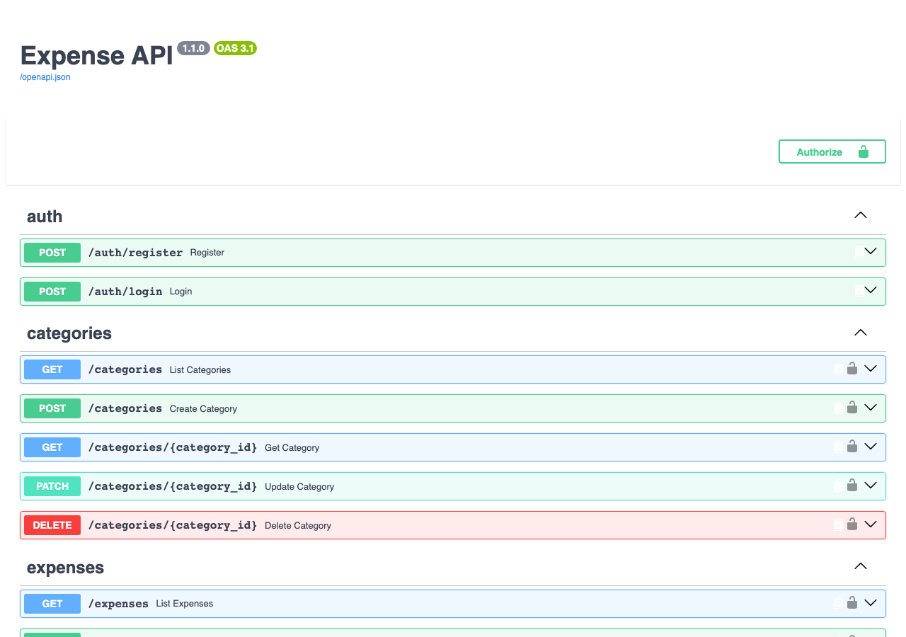
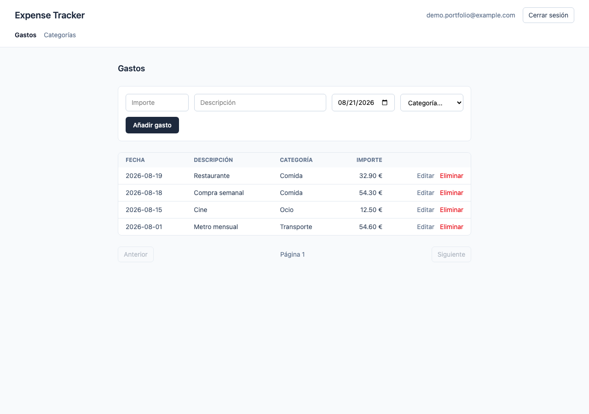

<p align="right"><sub><a href="00-indice.md">Índice</a></sub></p>

# 1 · Gestión de gastos

`expense-api` + `expense-tracker-ui` — backend y frontend en repos independientes, relacionados solo por HTTP.

## 📝 Descripción

Aplicación full-stack de control de gastos personales: una API REST con autenticación y una SPA de React que la consume. El backend expone auth, categorías y gastos con CRUD completo; el frontend añade formularios validados, listado paginado y un cliente HTTP generado automáticamente desde el contrato real de la API.

## 🎯 Meta del proyecto

Primer proyecto del portfolio — demostrar el ciclo completo backend + frontend de un CRUD real con autenticación, en dos repos independientes que solo se comunican por red, con CI en ambos desde el principio.

## 🛠️ Tecnologías usadas

**Backend — `expense-api`**
FastAPI · SQLAlchemy 2.0 · Alembic (migraciones versionadas) · Pydantic v2 · JWT (OAuth2 password flow) · `slowapi` (rate limiting) · SQLite en local / PostgreSQL vía Docker Compose · pytest + pytest-cov · ruff + pre-commit · GitHub Actions

**Frontend — `expense-tracker-ui`**
React 19 + TypeScript + Vite · Tailwind CSS 4 · React Router (rutas protegidas) · TanStack Query · React Hook Form + Zod · `openapi-typescript` + `openapi-fetch` (cliente tipado generado desde el `/openapi.json` real del backend) · Vitest + React Testing Library + MSW

## 📸 Capturas

**Documentación interactiva del backend** (`/docs`, generada automáticamente por FastAPI):



**Dashboard del frontend**, con datos reales creados a través del propio flujo de la app:



## 📊 Situación actual

- [x] Auth JWT completa (registro, login, logout con manejo global de 401)
- [x] CRUD completo de categorías y gastos, protegido por auth
- [x] Migraciones con Alembic (esquema versionado)
- [x] Rate limiting en login (5 intentos/min por IP)
- [x] Logging estructurado y CORS configurado
- [x] Cliente API tipado end-to-end, generado desde el backend real
- [x] Tests (backend: pytest con cobertura ≥90% en CI; frontend: Vitest + RTL + MSW) y CI en GitHub Actions en ambos repos
- [x] Releases: `expense-api` v1.1.0, `expense-tracker-ui` v1.0.0
- [ ] Deploy real (Railway/Fly.io + Vercel/Netlify) — aplazado, requiere cuenta propia
- [ ] Filtros/búsqueda y gráficos de gasto por categoría en el frontend

## 🐛 Bugs importantes encontrados

1. **`ExpenseUpdate.date` solo aceptaba `null`** — nunca se podía actualizar la fecha de un gasto vía API. Causa: *shadowing* de nombres en Python (`date: Optional[date] = None` tapa el propio tipo `date` importado) en un schema Pydantic del backend. Lo detectó el generador de tipos del frontend, no ningún test existente — `openapi-typescript` generó `date?: null` en vez de `date?: string | null`, una señal inequívoca de que algo no cuadraba. Arreglado en `expense-api`, con test de regresión propio, no con un parche en el consumidor.
2. **JWT caducado a mitad de sesión** rompía la UI con un error genérico en vez de mandar al usuario a login — resuelto con un manejador global de 401 en el cliente API del frontend.
3. **`openapi-fetch` captura `fetch` una sola vez** al crear el cliente, así que los mocks de MSW en los tests nunca interceptaban nada hasta envolverlo en una función que resuelve `globalThis.fetch` en cada llamada.

## 💡 Aprendizajes técnicos

- Un generador de tipos automático (`openapi-typescript`) puede actuar como red de seguridad adicional: detectó un bug de backend real antes que la suite de tests.
- El *shadowing* de nombres en Python es sutil y repetible — el mismo patrón ya había aparecido antes en un modelo SQLAlchemy de este mismo proyecto, y reapareció en un schema Pydantic distinto.
- Separar claramente "tests contra mocks" (frontend, con MSW) de "tests contra código real" (backend, con la DB real) evita que un mock enmascare un bug que solo existe en la integración real.

## ▶️ Cómo probarlo

```bash
# Backend
git clone https://github.com/Acedpol/expense-api.git && cd expense-api
python -m venv .venv && source .venv/bin/activate
pip install -r requirements-dev.txt
uvicorn app.main:app --reload
# → docs interactivas en http://localhost:8000/docs

# Frontend (en otra terminal)
git clone https://github.com/Acedpol/expense-tracker-ui.git && cd expense-tracker-ui
npm install
cp .env.example .env.local
npm run dev
# → http://localhost:5173, regístrate desde la propia UI
```

## 🔗 Enlaces

- [`expense-api`](https://github.com/Acedpol/expense-api) — [release v1.1.0](https://github.com/Acedpol/expense-api/releases/tag/v1.1.0)
- [`expense-tracker-ui`](https://github.com/Acedpol/expense-tracker-ui) — [release v1.0.0](https://github.com/Acedpol/expense-tracker-ui/releases/tag/v1.0.0)

---

<p align="center">
<a href="00-indice.md">← Índice</a> · <a href="02-asistente-rag.md">Siguiente: Asistente RAG →</a>
</p>
