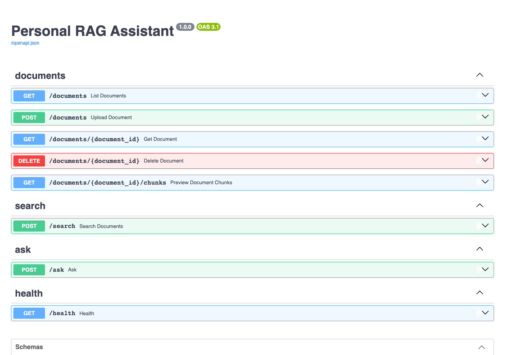
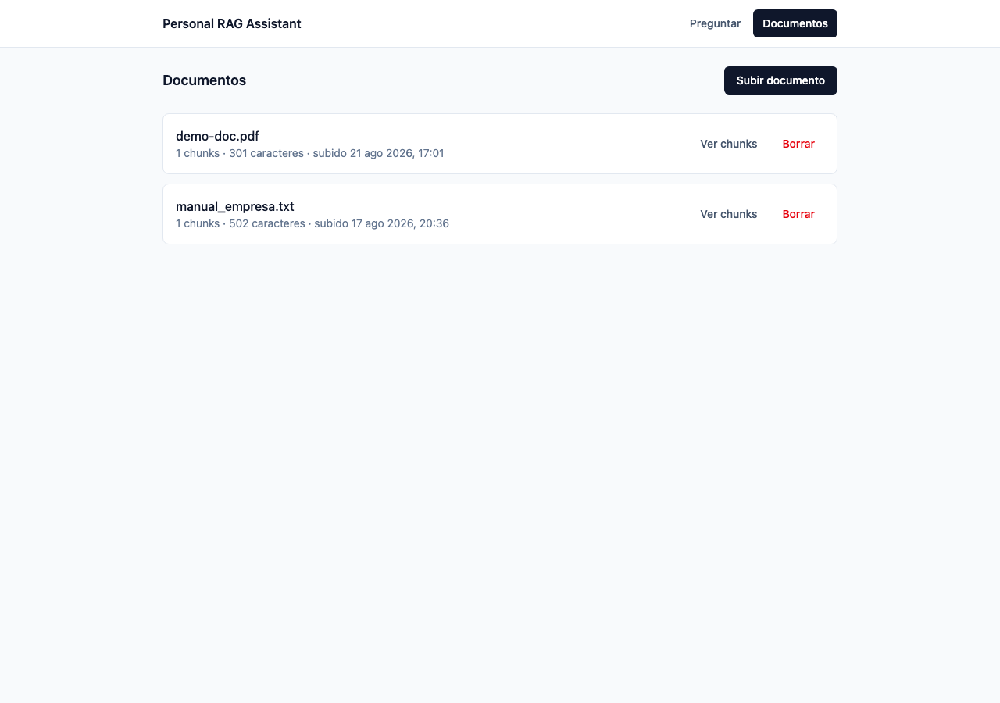
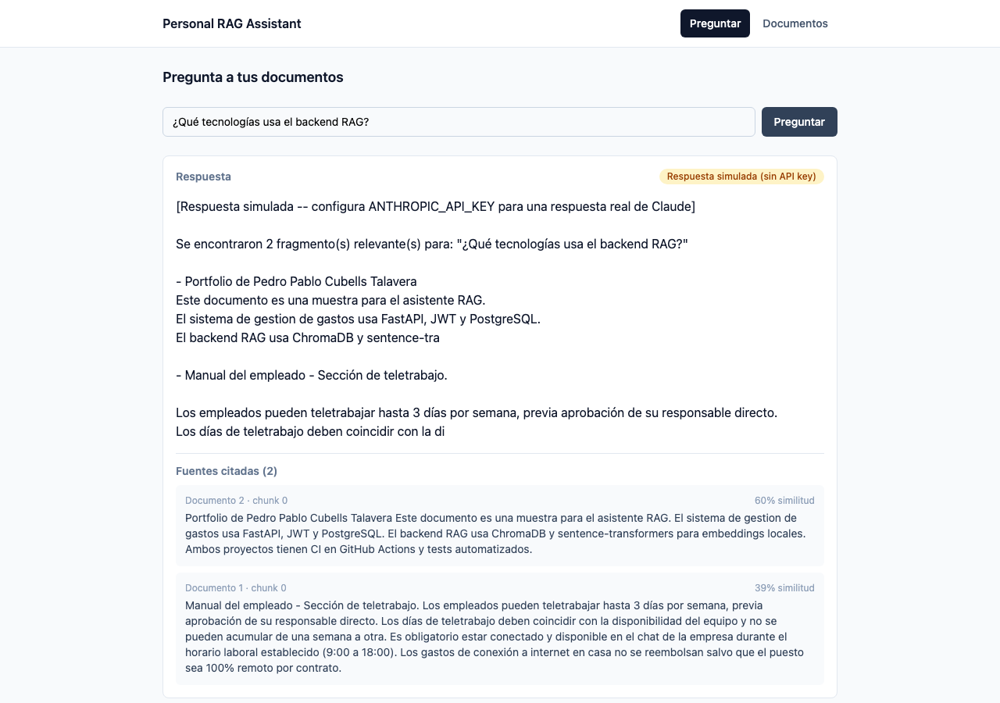

<p align="right"><sub><a href="00-indice.md">Índice</a></sub></p>

# 2 · Asistente RAG

`personal-rag-assistant` + `personal-rag-assistant-ui` — sistema de *retrieval-augmented generation* sobre documentos propios, en dos repos independientes.

## 📝 Descripción

Subes un documento (PDF), el sistema lo trocea e indexa, y puedes preguntarle en lenguaje natural — la respuesta viene anclada al contenido real, citando los fragmentos exactos usados, no un chat genérico que se inventa cosas. Sin autenticación, deliberadamente: es una herramienta de una sola colección compartida, el foco es la mecánica de RAG, no repetir JWT por tercera vez.

## 🎯 Meta del proyecto

Segundo bloque del portfolio — demostrar IA aplicada de verdad (pipeline de RAG completo, no una llamada envuelta a un LLM): extracción, chunking, embeddings, vector store y generación, con selección automática entre proveedor real y simulado.

## 🛠️ Tecnologías usadas

**Backend — `personal-rag-assistant`**
FastAPI · SQLAlchemy (solo metadata, sin Alembic — deliberado) · `pypdf` (extracción) · `langchain-text-splitters` (chunking real, respeta párrafos/frases) · `sentence-transformers` (`all-MiniLM-L6-v2`, embeddings **locales**, sin coste ni API key) · `chromadb` (vector store, métrica coseno) · `anthropic` (Claude, opcional) · pytest · ruff

**Frontend — `personal-rag-assistant-ui`**
React 19 + TypeScript + Vite · Tailwind CSS 4 · TanStack Query · `openapi-typescript` + `openapi-fetch`

## 📸 Capturas

**Documentación interactiva del backend:**



**Listado de documentos** en el frontend:



**Pregunta real respondida**, con fuentes citadas y el badge de proveedor simulado (sin `ANTHROPIC_API_KEY` configurada en esta demo):



## 📊 Situación actual

- [x] Ingesta de documentos con extracción de texto real
- [x] Chunking real (respeta estructura del texto, no corte fijo)
- [x] Embeddings locales + indexado en ChromaDB con métrica coseno
- [x] Retrieval semántico con score de similitud visible
- [x] Selección automática de proveedor: Claude real si hay `ANTHROPIC_API_KEY`, generador simulado honesto si no la hay
- [x] Dos pantallas en el frontend: Documentos (subir/listar/borrar/ver chunks) y Preguntar
- [x] 18 tests contra el pipeline real (embeddings y ChromaDB reales, no mockeados) + CI
- [x] Releases: ambos repos en v1.0.0
- [ ] Deploy real — aplazado, requiere cuenta propia
- [ ] Alembic si el esquema de metadata crece (por ahora una tabla no lo justifica)

## 🐛 Bugs importantes encontrados

1. **`pydantic-settings` 2.11 rompe el parseo de `List[str]` desde variables de entorno** de una forma que la versión usada en `expense-api` (2.5.2) no sufría — mismo patrón de código, versión de librería distinta, comportamiento distinto. Resuelto guardando el valor como `str` y exponiendo la lista vía `@property`, en vez de tipar el campo directamente como lista.
2. **ChromaDB con métrica de distancia equivocada**: por defecto usa L2 al cuadrado, no coseno — el score de similitud devuelto no tenía sentido hasta configurar `hnsw:space: cosine` explícitamente. Solo se detectó calculando el score de verdad contra casos conocidos, no simplemente comprobando que `search()` devolvía resultados.
3. **Ruta `async def` con código bloqueante**: `sentence-transformers.encode()` corriendo directamente en una ruta `async def` congelaba el *event loop* completo del servidor — ninguna otra petición se atendía mientras tanto, ni siquiera `/health`. Solucionado usando `def` normal (FastAPI paraleliza rutas síncronas en un thread pool automáticamente).

## 💡 Aprendizajes técnicos

- Una librería puede cambiar de comportamiento entre versiones aunque el código que la usa sea idéntico al de otro proyecto propio — nunca asumir que "ya funcionó una vez" generaliza sin verificar la versión instalada.
- Un pipeline de embeddings/vector search puede "funcionar" (devolver resultados) y estar completamente mal calibrado a la vez — el bug de métrica de distancia solo se ve calculando y revisando el score real, no solo comprobando que la llamada no falla.
- `async def` en FastAPI no es gratis: solo tiene sentido para I/O verdaderamente asíncrono. Código de cómputo intensivo sin `await` real debe ir en `def` normal para no bloquear el event loop del proceso entero.

## ▶️ Cómo probarlo

```bash
# Backend
git clone https://github.com/Acedpol/personal-rag-assistant.git && cd personal-rag-assistant
python -m venv .venv && source .venv/bin/activate
pip install -r requirements-dev.txt
cp .env.example .env
uvicorn app.main:app --reload --port 8010
# → docs interactivas en http://localhost:8010/docs

# Frontend (en otra terminal)
git clone https://github.com/Acedpol/personal-rag-assistant-ui.git && cd personal-rag-assistant-ui
npm install
cp .env.example .env
npm run dev
```

Sin `ANTHROPIC_API_KEY`, las respuestas son simuladas pero honestas (muestran literalmente qué fragmentos se recuperaron); añadiéndola a `.env` del backend, `/ask` empieza a responder con Claude real sin tocar código.

## 🔗 Enlaces

- [`personal-rag-assistant`](https://github.com/Acedpol/personal-rag-assistant) — [release v1.0.0](https://github.com/Acedpol/personal-rag-assistant/releases/tag/v1.0.0)
- [`personal-rag-assistant-ui`](https://github.com/Acedpol/personal-rag-assistant-ui) — [release v1.0.0](https://github.com/Acedpol/personal-rag-assistant-ui/releases/tag/v1.0.0)

---

<p align="center">
<a href="01-gestion-de-gastos.md">← Gestión de gastos</a> · <a href="00-indice.md">Índice</a> · <a href="03-proximos-pasos.md">Siguiente: Próximos pasos →</a>
</p>
